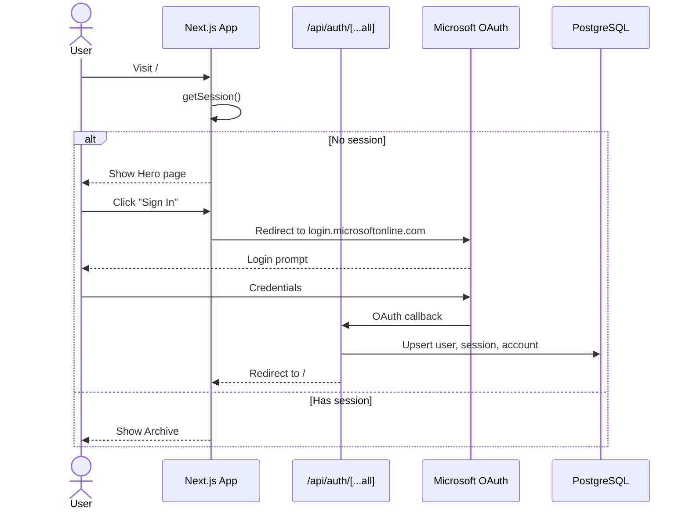
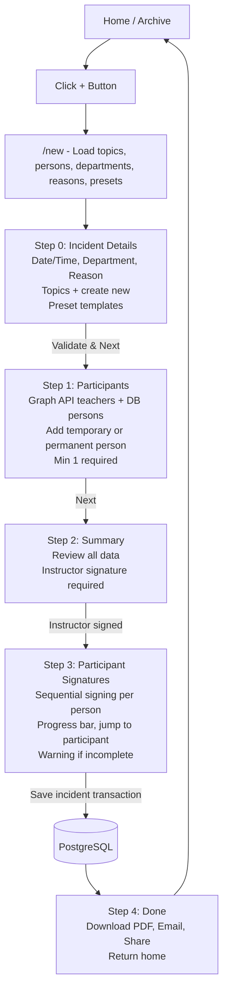
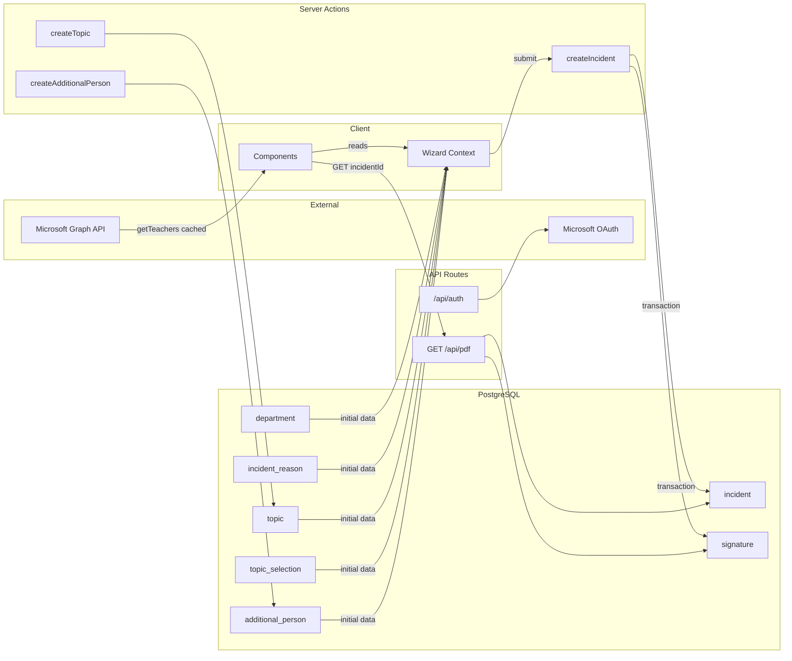
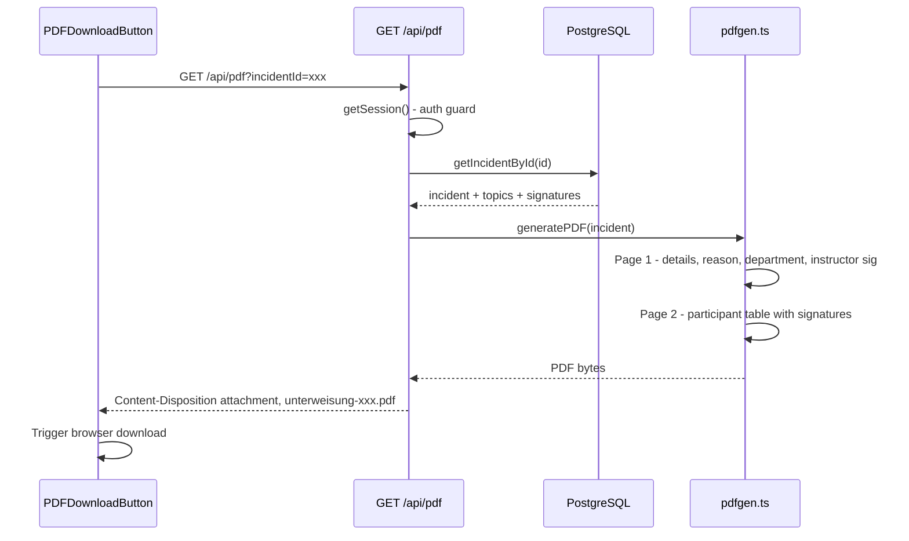
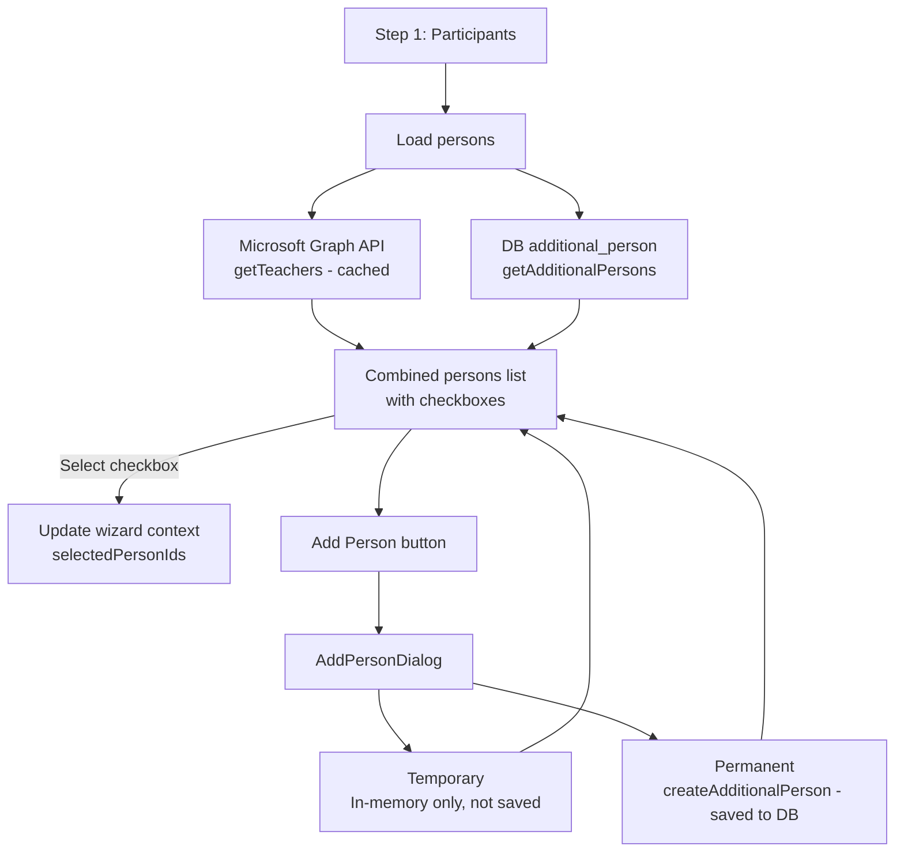
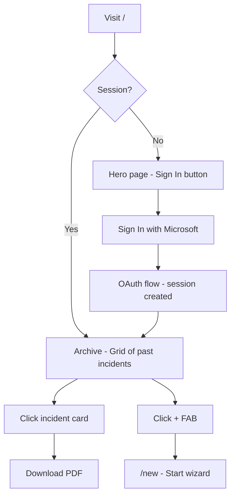

# App Flow Diagrams

## 1. Authentication Flow

---

## 2. Incident Wizard Flow

---

## 3. Data & API Flow

---

## 4. PDF Generation Flow

---

## 5. Participant Management Flow

---

## 6. Home Page Routing

